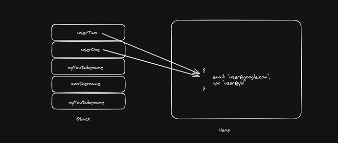
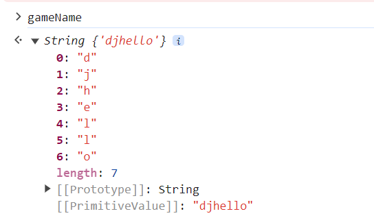

# Basics

- mdn documentation
- ECMAScript - original documentation

## Variables

- const: to declare constant variables, which can't be changed
- let: to declare variables, whose value can be modified later. We use let now, because it uses scope
- var: to declare variables, whose value can be modified later. We don't use var because it doesn't work for scope

## Data Types

- number -> integer/float
- bigInt -> big integers
- string
- boolean -> true/false
- null -> standalone value (empty value)
- undefined -> when value isn't defined
- symbol -> unique

- object 

- typeof : used to check the data type of a value or a variable\
Note: typeof null is *object* and typeof undefined is *undefined* and typeof function is function only but it is called object function

They are of 2 types: 
- Primitive : call by value takes place. The changes are made in the copy and we get the value and not the address of the variable
    - String, Boolean, Number, null, undefined, symbol, BigInt
- Reference (Non-primitive) : memory address
    - Arrays, Objects (Key-value pair), Functions\
    Data type of all of them are object

## Conversion

- If we want to convert the datatype of any value, we can input the value in datatype keyword.\
Eg: Number("33") -> 33\
\
Note: In case of type casting to **number**
- If the value passed cannot be converted to a number, JS will convert it and show its data type to be a number, but it will actually be *NaN* (Not a number).
- If the value passed is null, converted value will be *0*
- If the value passed is undefined, converted value will be *NaN*
- If the value passed is true/false, converted value will be *1/0* accordingly
\
Note: In case of type casting to **boolean**  
- If the value passed is 1 or any value/0, converted value will be *true/false*
- If the value passed is ""/null/undefined, converted value will be *false*
- If the value passed is "string", converted value will be *true*

## Operations

- While concatenation of string and numbers:\
If we have addition of numbers followed by string, it will add the numbers and concatenate with string, returning the whole answer as string\
In case of string followed by values, it will consider everything to be string and simply concatenate it
- +true converts true to 1 and +"" which is false, converts it to 0

## Comparisons

- JS sometimes gives unexpected results while comparisons, so make sure the datatype of both elements while comparison is equal
- During null comparison with 0:
    - null > 0 gives false
    - null == 0 gives false
    - null >= gives true\
    because equality check and comparison work differently. Comparisons convert null to 0 and hence, null > 0 gives us false
- Undefined comparison with 0 always gives false irrespective of the operation
- Strict check (===): It checks the datatype as well

## Memory Allocation

- Stack (Primitive) : we get a copy of the variable and changes are made to the copy
- Heap (Non-Primitive) : we get a reference of the variable and changes are made to the original

## Strings

- Use backticks for string concatenation, so that we can inject the variable directly and is called string interpolation
- gameName is an object which is stored as key:value pair\

- Each string has a prototype, which contains various functions which can be applied on the string. This can be seen in the console or in terminal. In terminal, this will look empty, but actually contains a lot of things.
- Substring returns the string from start index to end index - 1, can't give negative values
- Slicing returns a part of string, we can send negative indexes as well
- In trim, we can remove the white spaces from start and end of the string. It works on line terminators as well
- In replace function, we can replace a particular substring with another substring
- includes function tells us if any particular substring is present in the string or not
- Split is used to convert a string into array by dividing the string into different parts on the basis of a separator

## Nums and Maths
- We can explicitly declare a variable as number.
- toString function converts the number to a string and we can use the functions of string on it as well
- toFixed function gives us the number to precise decimal points  
- toPrecision gives the rounded of value to specific digits. If the argument number is smaller than the digits before decimal point, we will get the answer in exponential.\
It returns a string
- toLocaleString gives us a number according to the number system(en-IN, indian number system)
- Javascript gives us the minValue and the maxValue
\
- we can find max/min of more than 2 elements at one time
- Math.random() - gives a random different value each time between 0 and 1\
1 is usually added to the value to avoid cases like 0.0___ 

## Date and Time
- It is calculated in milliseconds wrt to a earlier date as decided the team
- Currently it can't be directly accessed as we access Math, but it might happen in future.
- We create a Date() object, it is not in a readable format
- When we convert it to string, it becomes more readable
- We can create our own date as well (year,month,date,hour,minute)\
note: month will start from 0
- Timestamp is used when we need to compare on the basis of milliseconds

## Extras

- console.log(): for printing variable's value
- console.table([]): for printing more than one variable's value in the form of a table
- If we declare any variable and don't assign a value to it, it is declared as 'undefined'
- "use strict"; : written at the starting of the file and makes sure the newer version of JS is used
- alert(): it is used to send a pop-up message on the website. It can't be used on terminal
- JS is dynamically typed, means we don't declare the datatype of the variable

